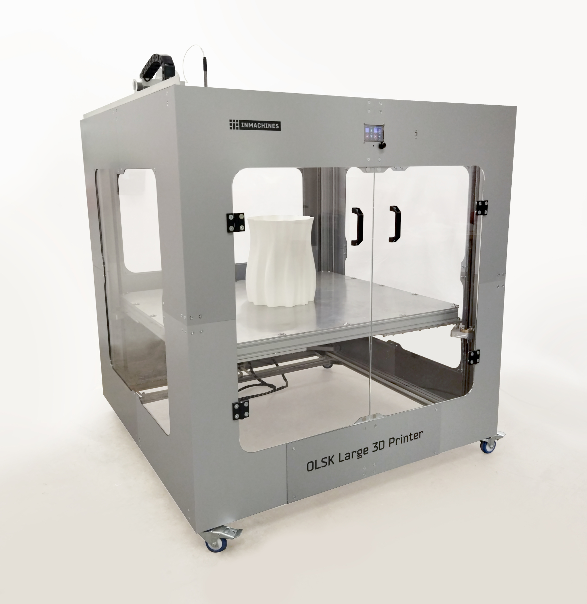
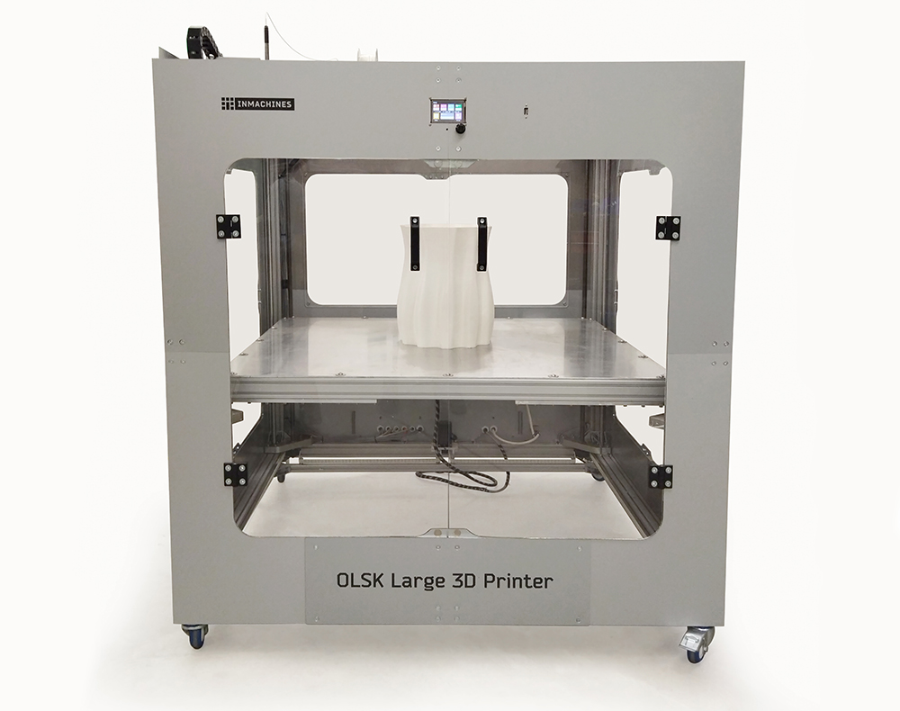
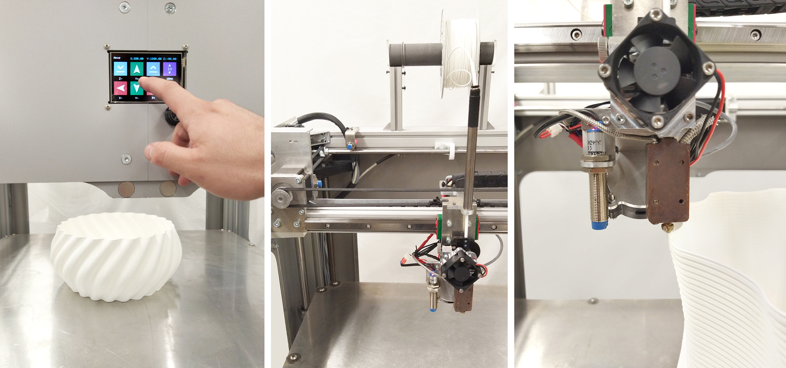

<h1 style=align="center">OLSK Large 3D Printer V1</h1>

<i>Open Source 3D Printer - Large version - Open Lab Starter Kit</i>

 

Introduction
--

OLSK Large 3D Printer is a big format 3D Printer with large printing volume of 1000 x 1000 x 1000 mm, making it the largest open source 3D printer. It features a large volume hot-end of a 1.4 mm single nozzle, Titan Aero extruder with CNC milled copper heating block (80W heater) and 4 x 700W AC bed heaters with solid state relay, resulting in faster prints. This machine can print with max speed of 200 mm/s and it is also equipped with inductive sensors for homing, auto calibration of the bed and touch screen. Its design innovates by using bended parts which can be replicable in Fab Labs, such as the housing panels. The converter board and the heating block are custom made, joining in the whole design fabricated parts with standard components.

The Assembly Workbook
--

All OLSK machines are open source and have the BOM and necessary files available in this repository for replication. The assembly of parts is also documented in a workbook where each step contains a list of parts, tools and instruction remarks, following a logic order to provide a smooth assembly.

Specifications V1
--

- nozzle: 1.4 mm
- extruder: Titan Aero with 80W heating catridge
- bed heating: 4 x 700W AC with solid state relay
- printing volume: 1000 x 1000 x 1000 mm
- max. printing speed: 200 mm/s
- housing: aluminum composite
- frame: 60 x 60 mm aluminum profiles
- motion: GT2 10 mm belt, lead screws
- guides: 15 mm linear rails, linear shafts
- motors: stepper motor NEMA 24
- inductive endstops
- automatic bed leveling with inductive probe
- touch screen 

Files
--

- **[CAD](cad)**
- **[Converter PCB](converterPCB)**
- **[Main Board](https://github.com/bigtreetech/SKR-2)**
- **[Firmware](firmware)**
- **[Assembly Workbook](OLSK_Large_3D_Printer_V1_Assembly_Workbook.pdf)**
- **[Wiring Schematic](OLSK_Large_Printer_V1_Wiring_Schematic.pdf)**

Author
--

OLSK Large 3D Printer has been designed and built by **[InMachines Ingrassia GmbH](https://www.inmachines.net/)**.

 

Machine design:
- **[Daniele Ingrassia](https://www.linkedin.com/in/danieleingrassia/)**
- **[Wilhelm Schütze](http://fabacademy.org/archives/2015/sa/students/schutze.wilhelm/index.html)**

The machine is part of the **[Open Lab Starter Kit (OLSK)](https://www.inmachines.net/open-lab-starter-kit)** group of open source digital fabrication machines.

OLSK is developed by **[InMachines Ingrassia GmbH](https://www.inmachines.net/)** for the **[Dtec project](https://dtecbw.de/home/forschung/hsu/projekt-fabcity)** at **[Fab City Hamburg](https://www.fabcity.hamburg/en/)**.

OLSK Partners:
  

Contact
--

- daniele@inmachines.net
- [https://www.inmachines.net/](https://www.inmachines.net/)

License
--

Hardware design, CAD and PCB files, BOM, settings and other technical or design files are released under the following license:

- CERN Open Hardware Licence Version 2 Weakly Reciprocal - **[CERN-OHL-W](LICENSE_CERN_OHL_W_V2.txt)**

Assembly manual, pictures, videos, presentations, description text and other type of media are released under the following license:

- Creative-Commons-Attribution-ShareAlike 4.0 International - **[CC BY-SA 4.0](LICENSE_CC_BY_SA_4.0.txt)**
