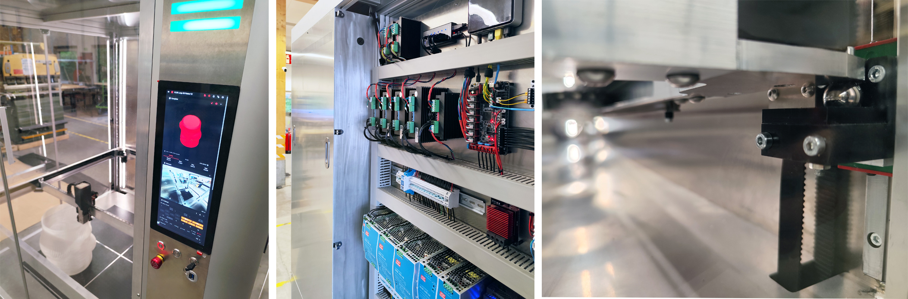
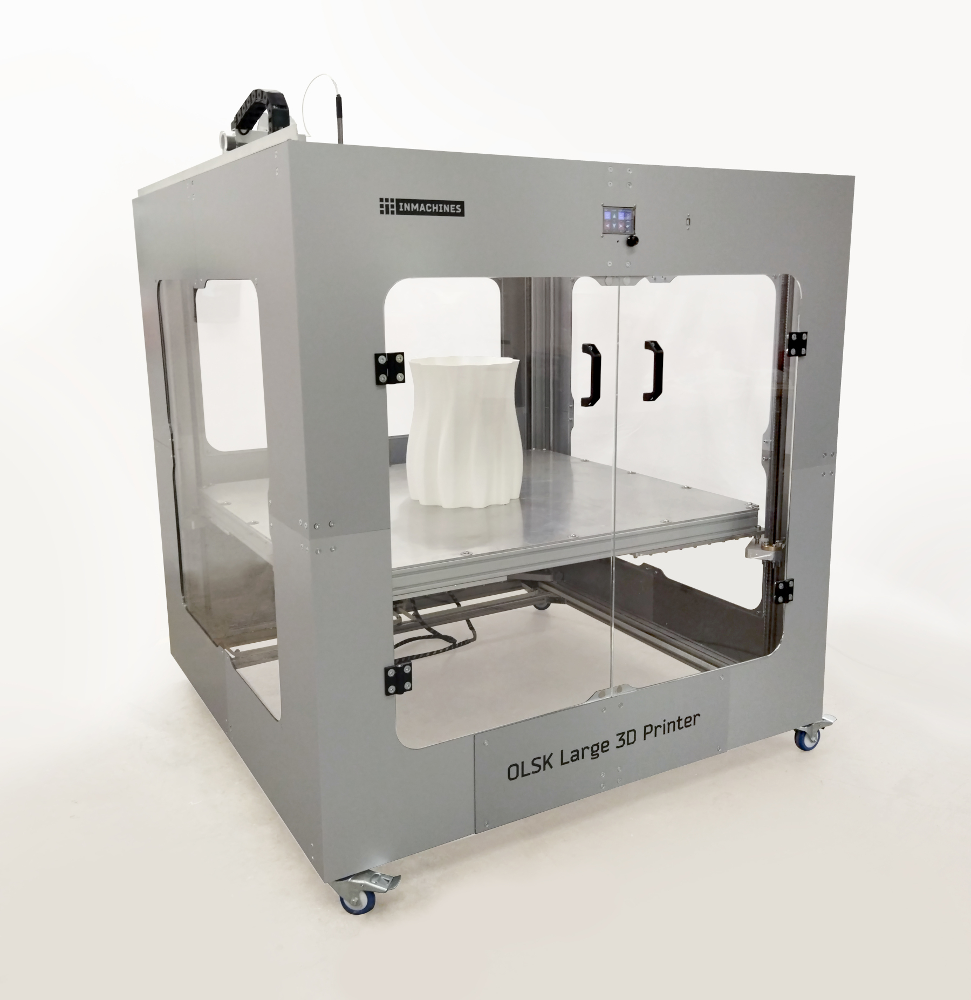

<h1 style=align="center">OLSK Large 3D Printer V3</h1>

<i>Open Source 3D Printer - Large version - Open Lab Starter Kit</i>

 

Introduction
--

OLSK Large 3D Printer is a big format 3D Printer with large printing volume of 1000 x 1000 x 1300 mm, making it the largest open source 3D printer. It is fully enclosed with access on two sides, has an efficient bed system with automated modular heating and Eddy Current Surface Scanner and has 1000 m/s travel speed. It has an industrial design, using linear rails on all axis, a quad-point self-leveling core XY gantry (4 x independent motors) and a built-in accelerometer.
Kinetic joints for non-planar printing. It also features local and remote access, customized Klipper firmware, touch screen, camera, LED status indicator, easy belt tensioning system and ethernet and WiFi connectivity.

The Assembly Manual
--

All OLSK machines are open source and have an assembly manual, the BOM and necessary files available in this repository for replication. The assembly manual is an interactive 3D guide though each step and contains a list of parts, tools and instruction remarks, which follow a logical order to provide a smooth assembly.

- **[Assembly Manual](https://open-lab-starter-kit.github.io/OLSK-Large-3D-Printer/)**

Specifications V3
--

- Printing volume: 1000 x 1000 x 1300 mm
- Filament based (60mm³/s)
- Large melt zone compatible with standard V6 nozzles (1.2mm, 0.9 layer height)
- Filament sensor
- Fully enclosed housing
- Motion system: core XY flying gantry
- Linear rails on all axis
- Quad point self-leveling gantry
- Travel speed: 1000m/s
- Built-in accelerometer
- Kinetic joints for non-planar printing
- Automated modular heating system
- Eddy current surface scanning
- Local and remote access
- Mounted touchscreen
- Customized Klipper firmware
- Camera
- LED status indicators
- Ethernet and WiFi connectivity
- Overcurrent, overheating and power loss protection
- Built-in computer

Files
--

- **[CAD](cad)**
- **[Firmware](firmware)**
- **[Settings](settings)**
- **[Wiring Schematic](OLSK_Large_3D_Printer_V2_WiringSchematic.pdf)**
- **[BOM](OLSK_Large_3D_Printer_V3-BOM.xlsx)**

Author
--

OLSK Large 3D Printer has been designed and built by **[InMachines Ingrassia GmbH](https://www.inmachines.net/)**.

 

Machine design:

- **[Wilhelm Schütze](http://fabacademy.org/archives/2015/sa/students/schutze.wilhelm/index.html)**

The machine is part of the **[Open Lab Starter Kit (OLSK)](https://www.inmachines.net/open-lab-starter-kit)** group of open source digital fabrication machines.

OLSK is developed by **[InMachines Ingrassia GmbH](https://www.inmachines.net/)** for the **[Dtec project](https://dtecbw.de/home/forschung/hsu/projekt-fabcity)** at **[Fab City Hamburg](https://www.fabcity.hamburg/en/)**.

OLSK Partners:
  

Contact
--

- daniele@inmachines.net
- [https://www.inmachines.net/](https://www.inmachines.net/)

License
--

Hardware design, CAD and PCB files, BOM, settings and other technical or design files are released under the following license:

- CERN Open Hardware Licence Version 2 Weakly Reciprocal - **[CERN-OHL-W](LICENSE_CERN_OHL_W_V2.txt)**

Assembly manual, pictures, videos, presentations, description text and other type of media are released under the following license:

- Creative-Commons-Attribution-ShareAlike 4.0 International - **[CC BY-SA 4.0](LICENSE_CC_BY_SA_4.0.txt)**

Previous version
--

The previous versions of OLSK machines will always be available. 

**[OLSK Large 3D Printer V1 Repository](OLSK_Large_3D_Printer_V1)** 

