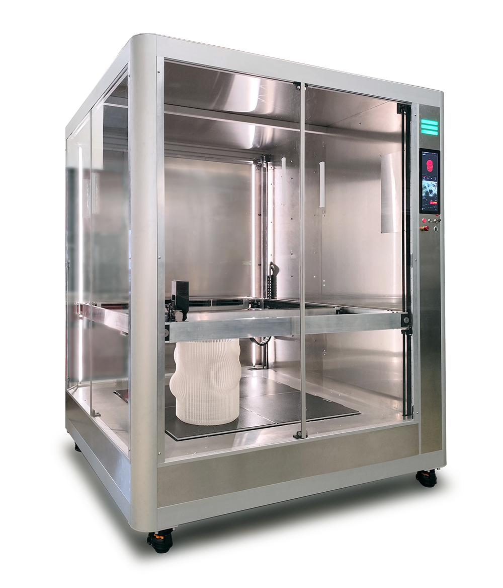
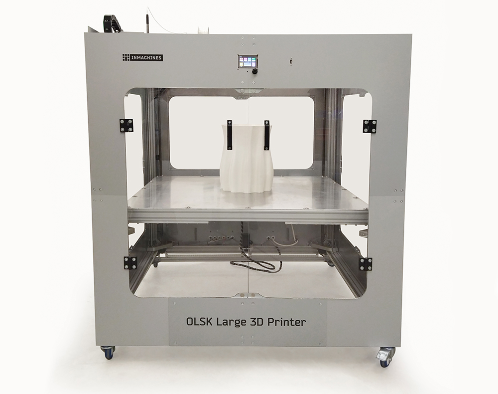
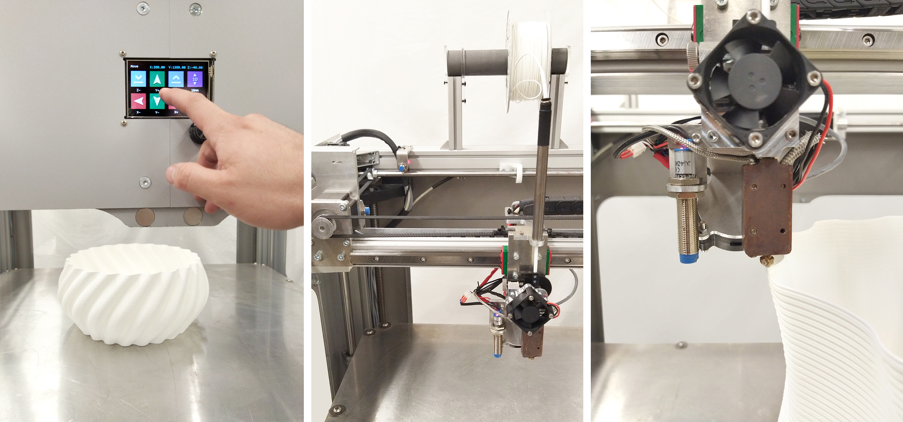

<h1 style=align="center">OLSK Large 3D Printer V3</h1>

<i>Open Source 3D Printer - Large version - Open Lab Starter Kit</i>

 

Introduction
--

OLSK Large 3D Printer is a big format 3D Printer with large printing volume of 1000 x 1000 x 1300 mm, making it the largest open source 3D printer.

The Assembly Workbook
--

All OLSK machines are open source and have an assembly manual, the BOM and necessary files available in this repository for replication. The assembly manual is an interactive 3D guide though each step and contains a list of parts, tools and instruction remarks, which follows a logic order to provide a smooth assembly.

- **[Assembly Manual](https://open-lab-starter-kit.github.io/OLSK-Large-3D-Printer/)**

Files
--

- **[CAD](cad)**
- **[Converter PCB](converterPCB)**
- **[Main Board](https://github.com/bigtreetech/SKR-2)**
- **[Firmware](firmware)**
- **[Wiring Schematic](OLSK_Large_Printer_V1_Wiring_Schematic.pdf)**

Author
--

OLSK Large 3D Printer has been designed and built by **[InMachines Ingrassia GmbH](https://www.inmachines.net/)**.

 

Machine design:

- **[Wilhelm Schütze](http://fabacademy.org/archives/2015/sa/students/schutze.wilhelm/index.html)**

The machine is part of the **[Open Lab Starter Kit (OLSK)](https://www.inmachines.net/open-lab-starter-kit)** group of open source digital fabrication machines.

OLSK is developed by **[InMachines Ingrassia GmbH](https://www.inmachines.net/)** for the **[Dtec project](https://dtecbw.de/home/forschung/hsu/projekt-fabcity)** at **[Fab City Hamburg](https://www.fabcity.hamburg/en/)**.

OLSK Partners:
  

Contact
--

- daniele@inmachines.net
- [https://www.inmachines.net/](https://www.inmachines.net/)

License
--

Hardware design, CAD and PCB files, BOM, settings and other technical or design files are released under the following license:

- CERN Open Hardware Licence Version 2 Weakly Reciprocal - **[CERN-OHL-W](LICENSE_CERN_OHL_W_V2.txt)**

Assembly manual, pictures, videos, presentations, description text and other type of media are released under the following license:

- Creative-Commons-Attribution-ShareAlike 4.0 International - **[CC BY-SA 4.0](LICENSE_CC_BY_SA_4.0.txt)**
